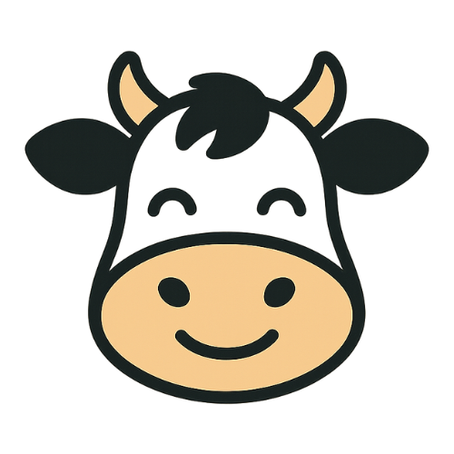
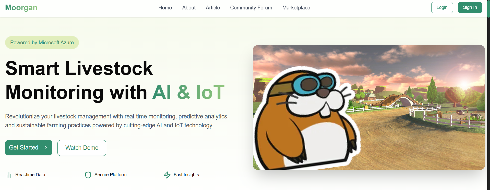
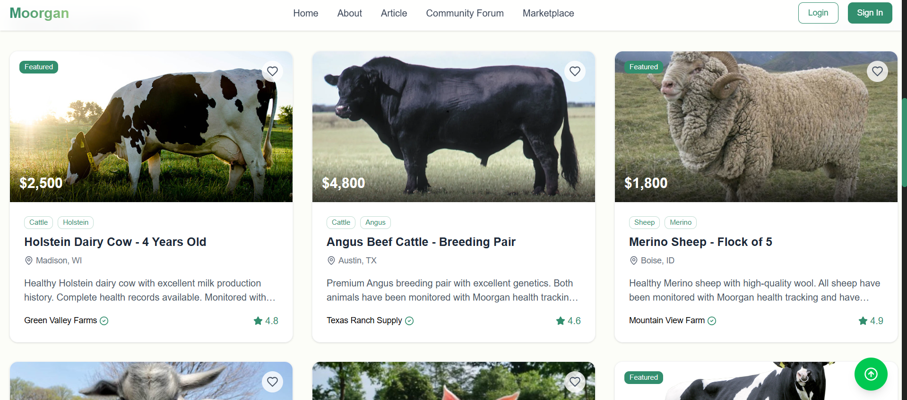
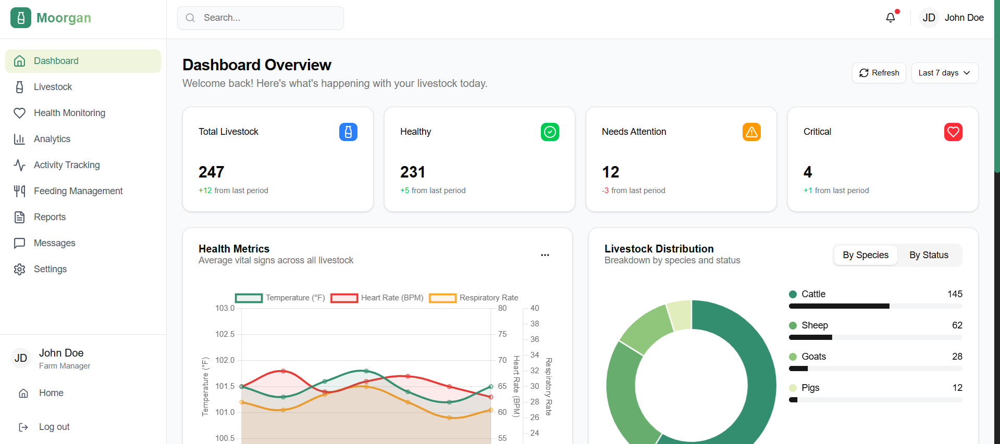
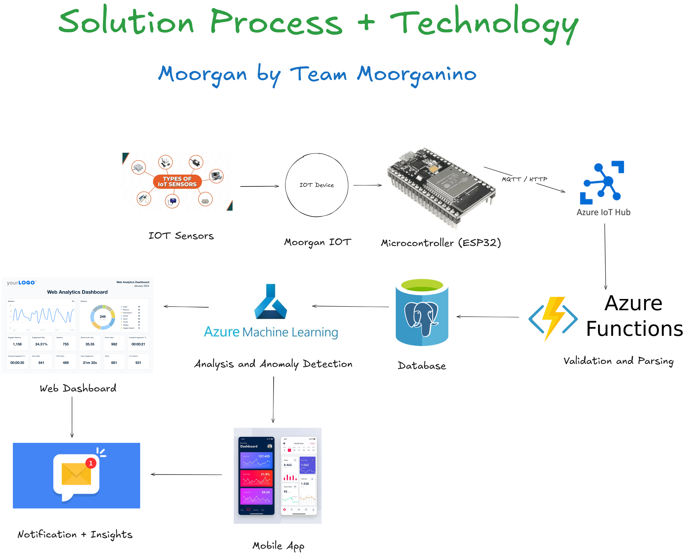
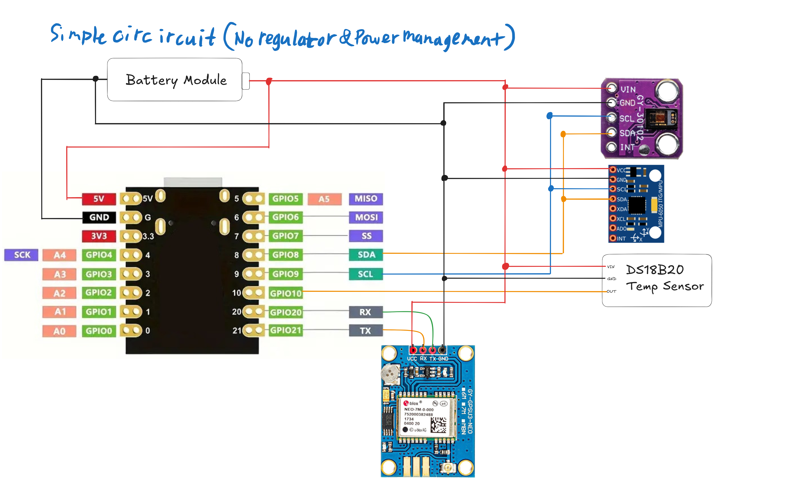
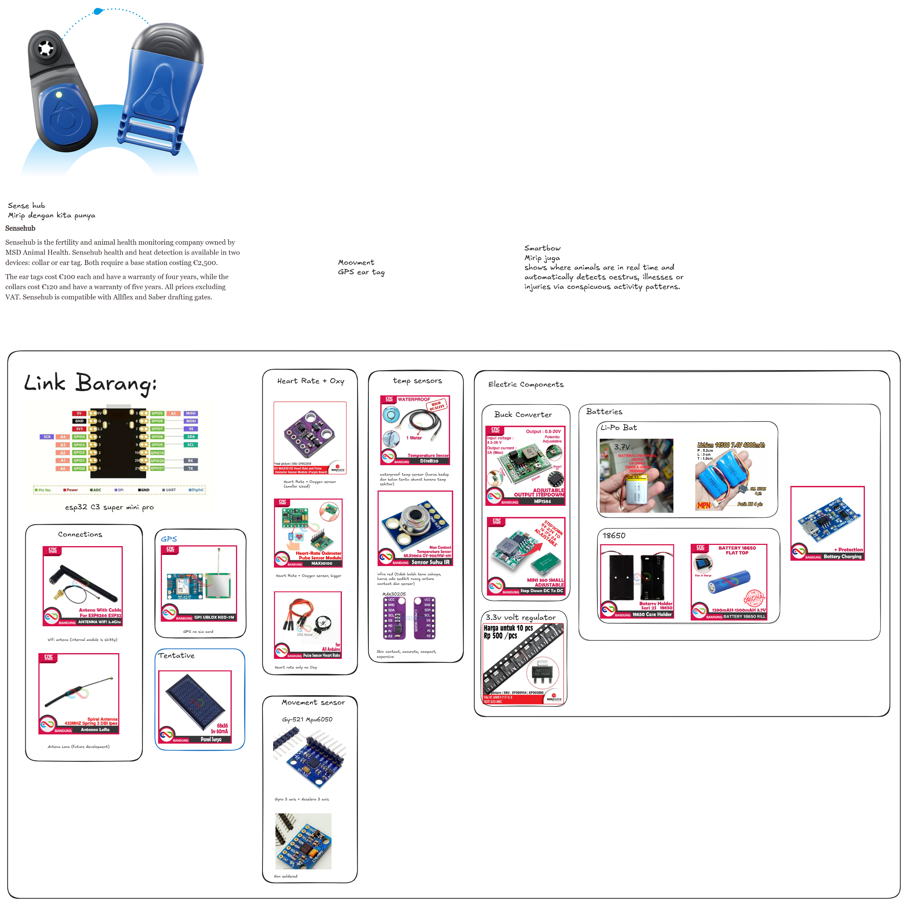

<h1 align="center"> Moorgan </h1> <br>
<p align="center">
  <a href="">
    
  </a>
</p>

<p align="center">
  <a href="https://education.elevaite.id/" target="_blank"><b>Microsoft ElevAIte - 2025</b></a><br>
  <b>Moorgan</b> is an <b>intelligent livestock monitoring system</b> to solve SDG Number 2 Zero Hunger (Especially in Agriculture).
  <b>Moorgan</b>  helps farmers monitor the health and behavior of their livestock in real-time using <b>IoT</b> and <b>AI anomaly detection</b>.
</p>

---

## 📃 Table of Contents
- [Complete Documentation](#📚-complete-documentation)
- [All GitHub Repository](#🌐-all-github-repository)
- [Introduction](#🌟-introduction)
- [Technology Stack](#🛠️-technology-stack)
- [Core Features](#🧩-core-features)
- [Live Demo](#🚀-live-demo)
- [Getting Started Locally](#🧰-getting-started-locally-monorepo-version)
- [Screenshots](#🖼️-screenshots)
- [Architecture Diagram](#🧭-erd-diagram)
- [Attachment](#⚙️-attachment)
- [Team](#👥-team)
- [Contact](#📬-contact)


---

## 📚 Complete Documentation

<ul>
    <li><b>Notion Documentation (Detail Documentation)</b></li>
    <a href="https://stanley-n-wijaya.notion.site/Moorgan-Documentation-1df73555b71f80fd9fd9dbfc655ce5a7?pvs=4">Notion Documentation</a>
    <li><b>Demo Video</b></li>
    <a href="https://drive.google.com/drive/folders/1XjZfySvS92iNH79hF5l6FU3b2-mCguZh?usp=sharing">Link Demo Video (Google Drive)</a>
    <li><b>Moorgan Google Drive</b></li>
    <a href="https://drive.google.com/drive/folders/1Slexo254LAhwieCQazA-peBe4Vl8fZJ5?usp=sharing">Moorgan Documents + Preliminary Research (Google Drive)</a>
</ul>

---

## 🌐 All GitHub Repository

<ul>
    <li><b>Main Repository</b></li>
    <a href="https://github.com/StyNW7/Moorgan">https://github.com/StyNW7/Moorgan</a>
    <li><b>Frontend Repository</b></li>
    <a href="https://github.com/StyNW7/Moorgan-Frontend">https://github.com/StyNW7/Moorgan-Frontend</a>
    <li><b>Backend Repository</b></li>
    <a href="https://github.com/StyNW7/Moorgan-Backend">https://github.com/StyNW7/Moorgan-Backend</a>
    <li><b>AI Repository</b></li>
    <a href="https://github.com/StyNW7/Moorgan-AI">https://github.com/StyNW7/Moorgan-AI</a>
    <li><b>IoT Repository</b></li>
    <a href="https://github.com/StyNW7/Moorgan-IoT">https://github.com/StyNW7/Moorgan-IoT</a>
</ul>

---


## 🌟 Introduction
**Moorgan** revolutionizes livestock farming through intelligent, real-time health and behavior monitoring. Combining IoT sensors and AI anomaly detection, Moorgan empowers farmers to detect health issues early, prevent loss, and optimize livestock productivity.
> "Every heartbeat, every step, every breath of your livestock matters. Moorgan listens and protects."   
> — *Moorgan Manifesto*

---

## 🛠️ Technology Stack
- **Frontend**: Vite, TypeScript, TailwindCSS, and ShadcnUI
- **Backend**: Express.js & Node.js
- **Database**: Azure PostgreSQL Flexible Server
- **AI Integration**: Python  & Hugging Face API
- **IoT Device**: Arduino C++ (ESP32 + Sensors)
- **Version Control**: Git & GitHub (Submodule Monorepo)
- **Deployment**:
  - Frontend: [Vercel](https://vercel.com)
  - Backend, AI, Database: Coming Soon!

---

## 🧩 Core Features

- 🔥 **Real-Time Livestock Monitoring**  
  Monitor temperature, heart rate, and motion of each livestock in real-time via IoT integration.

- 🧠 **AI Anomaly Detection**  
  Smart detection of anomalies such as fever, stress, reduced activity, and fertility prediction.

- 🐄 **Livestock Management System**  
  Manage livestock profiles, health history, vaccination records, and behavior patterns.

- 📈 **Data Analytics and Trends**  
  Visualize livestock health trends and detect early warning signs before problems escalate.

- 🚨 **Instant Alert System**  
  Receive instant notifications for any detected anomalies on your mobile or desktop.

- 🛒 **Marketplace & Community Forum**  
  Sell livestock and discuss farming tips with the community.

- 📚 **Knowledge Center**  
  Educational articles about livestock health, farming techniques, and veterinary advice.

- 🔒 **Role-Based Access Control**  
  Different dashboards and access for peternak, dokter hewan, and admin.

---

## 🚀 Live Demo
Visit the deployed application here (frontend only):
<br>
👉 [https://moorgan.vercel.app](https://moorgan.vercel.app)

---

## 🧰 Getting Started Locally (Monorepo Version)

### Prerequisites
- **Node.js** (v18 or above)
- **Python 3** (for AI server)
- **Git**
- **Arduino IDE** (for IoT ESP32 programming)

### Clone Monorepo & Initialize Submodules
```bash
git clone https://github.com/StyNW7/Moorgan.git
cd moorgan
git submodule update --init --recursive
```

### Run Setup Script
Make sure run this using git bash
```bash
chmod +x scripts/setup.sh
./scripts/setup.sh
```

### Run Dev Environment via Shell Script or Manually
[Prerequisite: Setup the .env files for Frontend, Backend, and AI.](#.env-configuration)
<br>
Then Run this command:

```bash
chmod +x scripts/dev.sh
./scripts/dev.sh update      # update all submodules
./scripts/dev.sh frontend    # run frontend
./scripts/dev.sh backend     # run backend
./scripts/dev.sh ai (Coming Soon)          # run AI
./scripts/dev.sh iot (Coming Soon)         # run IoT
./scripts/dev.sh dev (Run All - Coming Soon)         # run all
```

Or if you prefer manually you can do this:

Frontend:
```bash
cd moorgan-frontend
npm install
npm run dev
```

Backend:
```bash
cd moorgan-backend
npm install
npm run dev
npm run db:studio
```

AI:
```bash
coming soon
```

IoT:
```bash
coming soon
```

---

## 🔐 .env Configuration
Each service in the monorepo requires its own `.env` file. Below are the required environment variables:

### 📁 `moorgan-ai/.env`
```
Coming Soon
```

### 📁 `moorgan-frontend/.env`
```
Coming Soon
```

### 📁 `moorgan-backend/.env`
```
DATABASE_URL=
DATABASE_URL_UNPOOLED=
PGHOST=
PGHOST_UNPOOLED=
PGUSER=
PGDATABASE=
PGPASSWORD=
POSTGRES_URL=
JWT_SECRET=
```

📌 You can create these files manually or copy from a provided `.env.example` file (recommended).

---

## 🖼️ Screenshots

*Moorgan Landing Page*
<p align="center">
  
</p>

*Moorgan Livestocks Marketplace*
<p align="center">
  
</p>

*Moorgan Dashboard Overview*
<p align="center">
  
</p>

---

## 🧭 ERD Diagram

*Overall Database System Flow:*
<p align="center">
  
</p>

This diagram shows how our models connected in the backend an database.

Detail Diagram:
https://dbdiagram.io/d/Moorgan-680a3d001ca52373f535d6aa

---

## ⚙️ Attachment

*Moorgan Solution Process and Technology:*
<p align="center">
  
</p>

*Moorgan IoT Schemes:*
<p align="center">
  
</p>

*Moorgan IoT Components:*
<p align="center">
  
</p>

---

## 👥 Team
This project was created for Microsoft ElevAIte 2025 by Team Moorganino:

- **Stanley Nathanael Wijaya** - 2702217125
- **Nathaniel Alexander** - 2702276872
- **Jason Melvin Hartono** - 2702281481
- **David Christian** - 2702253143
- **Farrel Tobias Saputro** - 2702224036

---

## 📬 Contact
Have questions or want to collaborate?

- 📧 Email: stanley.n.wijaya7@gmail.com
- 💬 Discord: `stynw7`

<code>For a Better World by Monitoring Livestocks through Moorgan 🐮🌿</code>